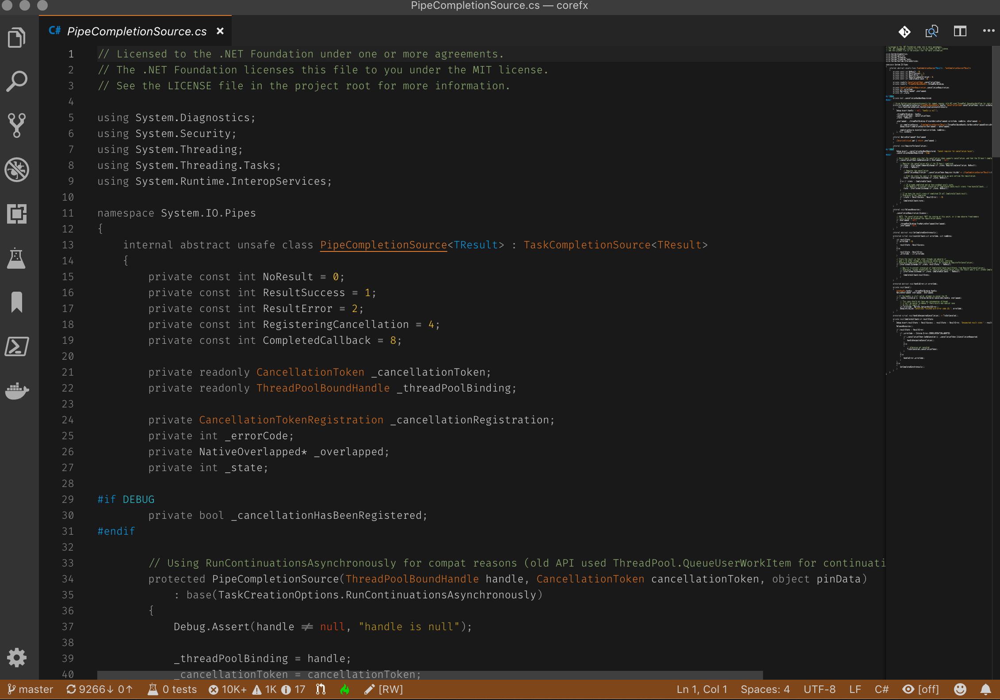
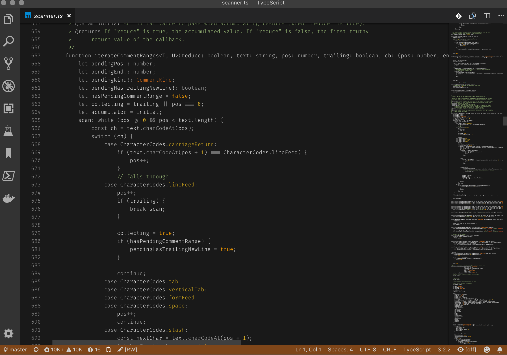
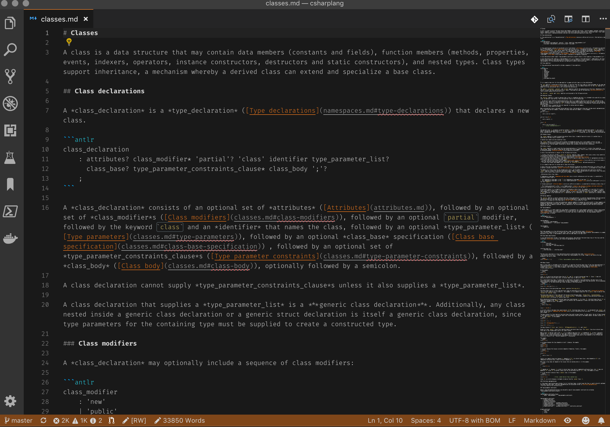
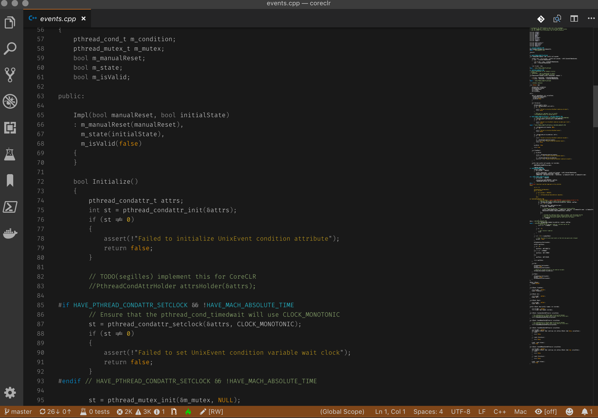
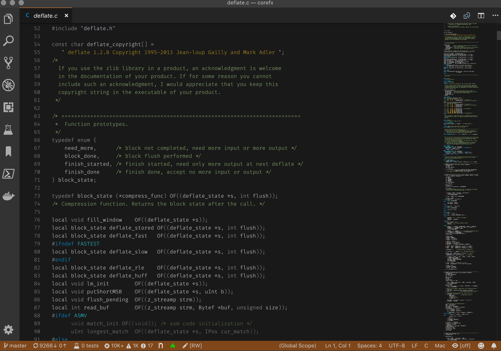
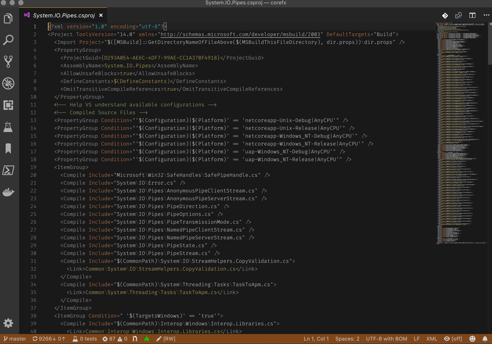

# OrangeMix

This is OrangeMix, a dark color theme based on the color orange.

The reasoning behind this color theme is summarized in [Designing OrangeMix](doc/designing-color-themes.md). Please see [Enhancing code readability in Code](doc/enhancing-code-readability-in-code.md) for more tips on improving code readability in Code.

## Language support

> Most formatting rules in the theme are language independent and should work as long as Code has grammar support for the specified language.

Examples:

> C#

> TypeScript

> Markdown

> C++

> C

> XML

## Contributing

I gladly accept issues or PRs for improvements and changes. Please do fork off if you rather want to create an even better color theme of your liking.

**Happy coding!**